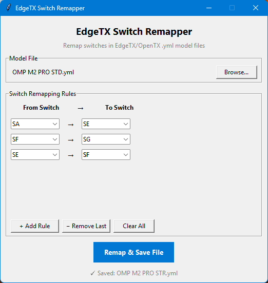

# EdgeTX Model Switch Remapper
Tool for remapping switches in EdgeTX model files .yml. Useful when transferring models between radios with different switch layouts e.g A Radiomaster TX15 to TX16. Load your model file, switch remapping rules and save the updated file — no manual editing required. It will run passes on each switch matching rule by order so you dont get collisions. 
Download [EdgeTX Switch Remapper](https://github.com/Onewaytohell/EdgeTX-Model-Switch-Remapper/raw/refs/heads/main/EdgeTX%20Switch%20Remapper.exe) or [EdgeTX Batch Switch Remapper](https://github.com/Onewaytohell/EdgeTX-Model-Switch-Remapper/raw/refs/heads/main/EdgeTX%20Batch%20Switch%20Remapper.exe)

